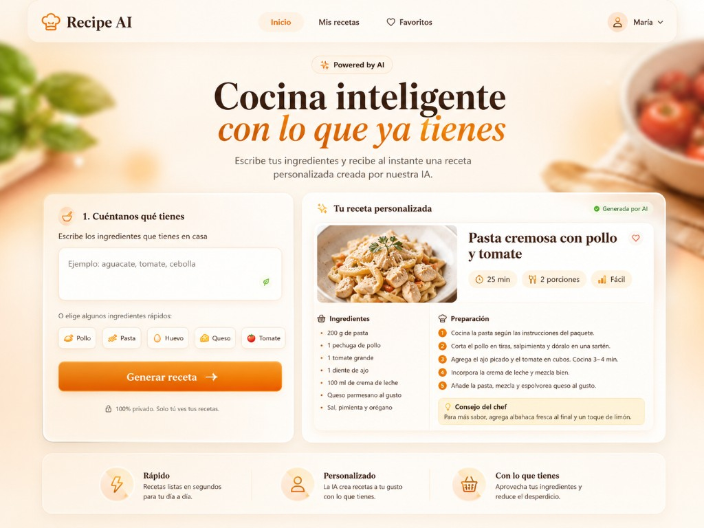

Site web that generates personalized recipes from user-provided ingredients using artificial intelligence. It integrates recipe generation with Amazon Bedrock, AI image generation with FLUX.1 Schnell through Hugging Face, and a responsive SaaS-style interface. The project includes robust input validation, error handling, visual fallbacks, serverless architecture, and secure server-side token management.

Key Features
Generates personalized recipes from user-provided ingredients.
Displays structured recipe data, including title, cooking time, servings, difficulty, ingredients, preparation steps, and chef tips.
Generates recipe images using FLUX.1 Schnell through the Hugging Face Inference Router.
Includes a local visual fallback when image generation fails.
Implements robust input validation for ingredient count, text length, and allowed characters.
Provides clear UX states for loading, success, error, and generated responses.
Handles backend, network, and external API errors with user-friendly messages.
Includes an image diagnostic endpoint to identify issues such as missing tokens, timeouts, network errors, unsupported providers, unaccepted model terms, or invalid non-image responses.
